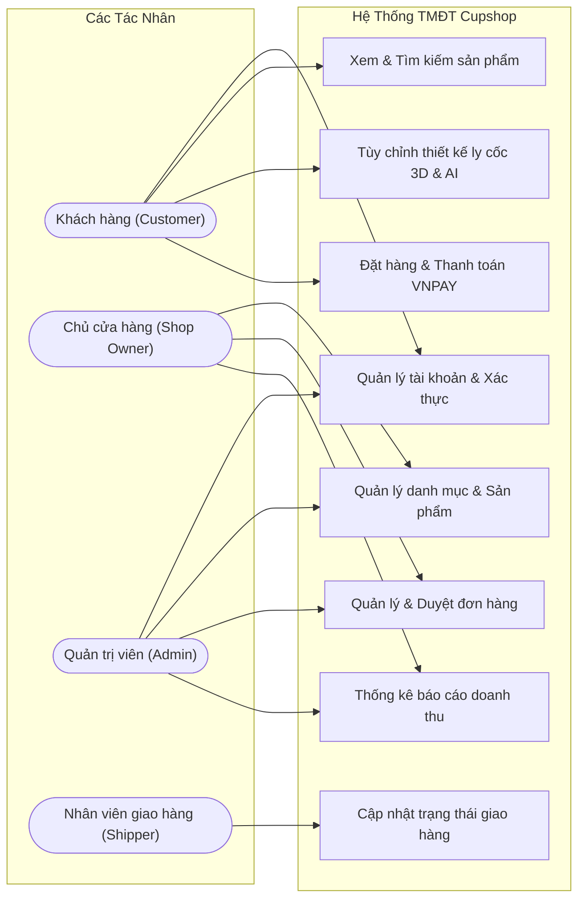
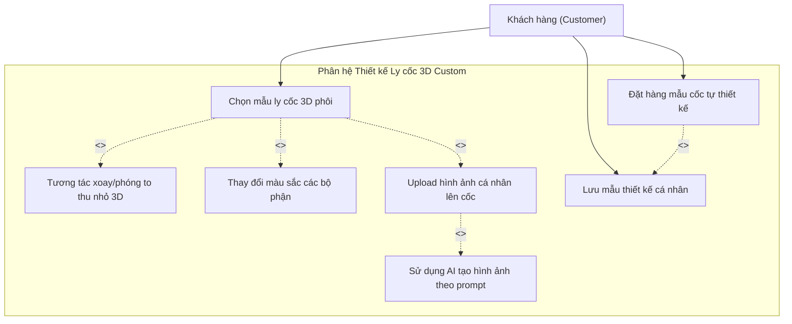
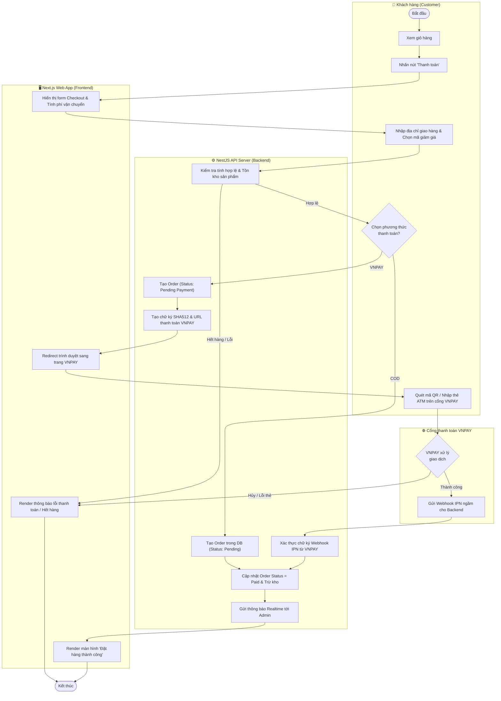
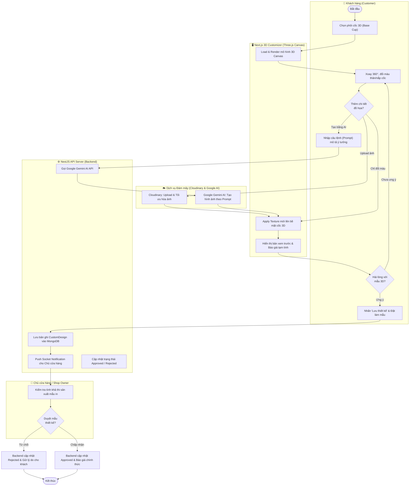
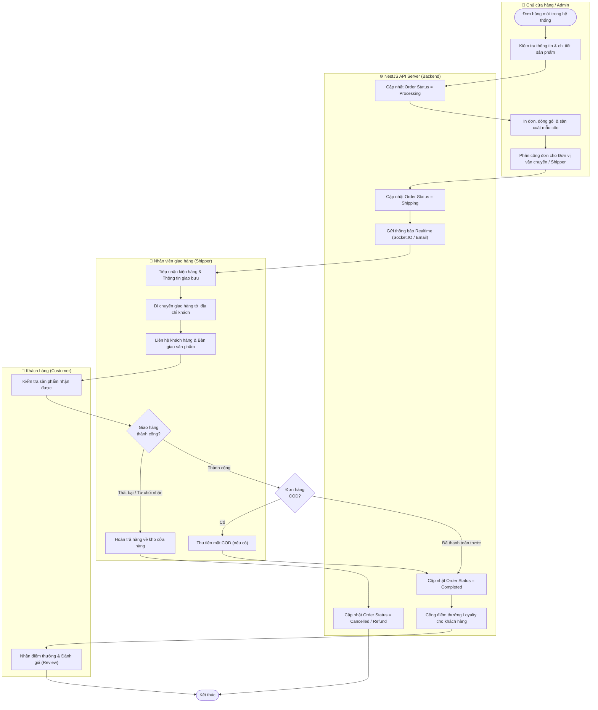
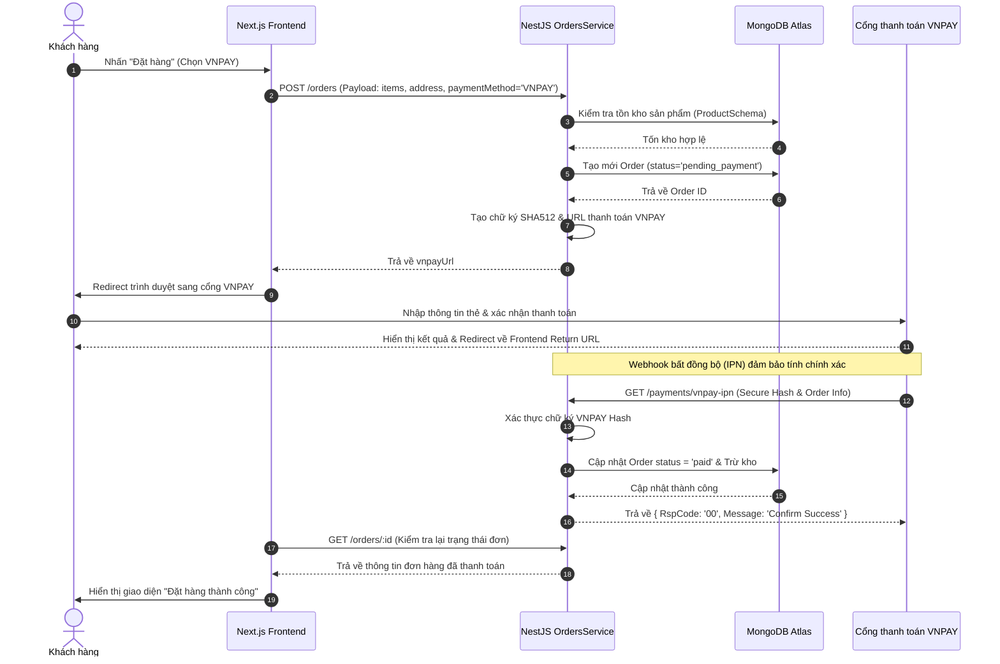
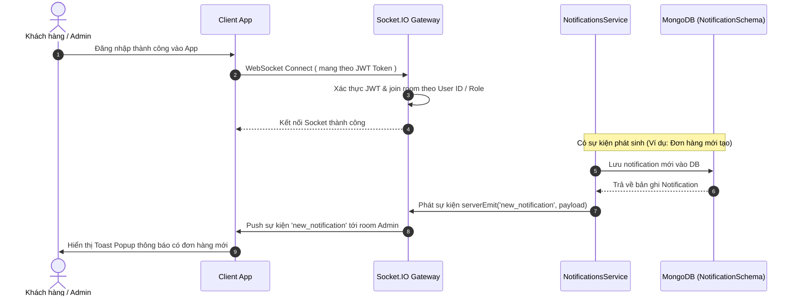
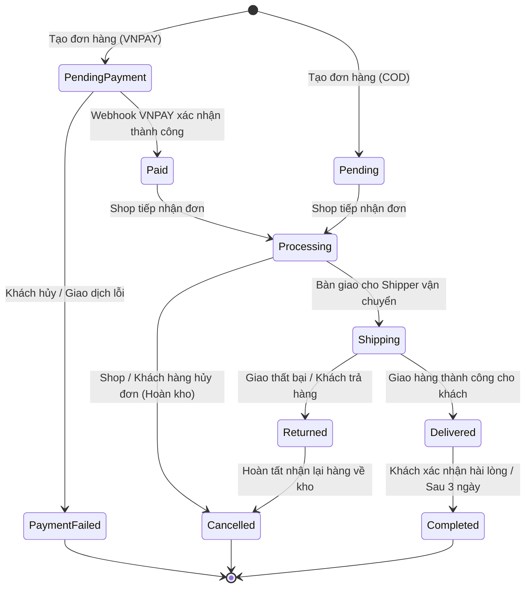
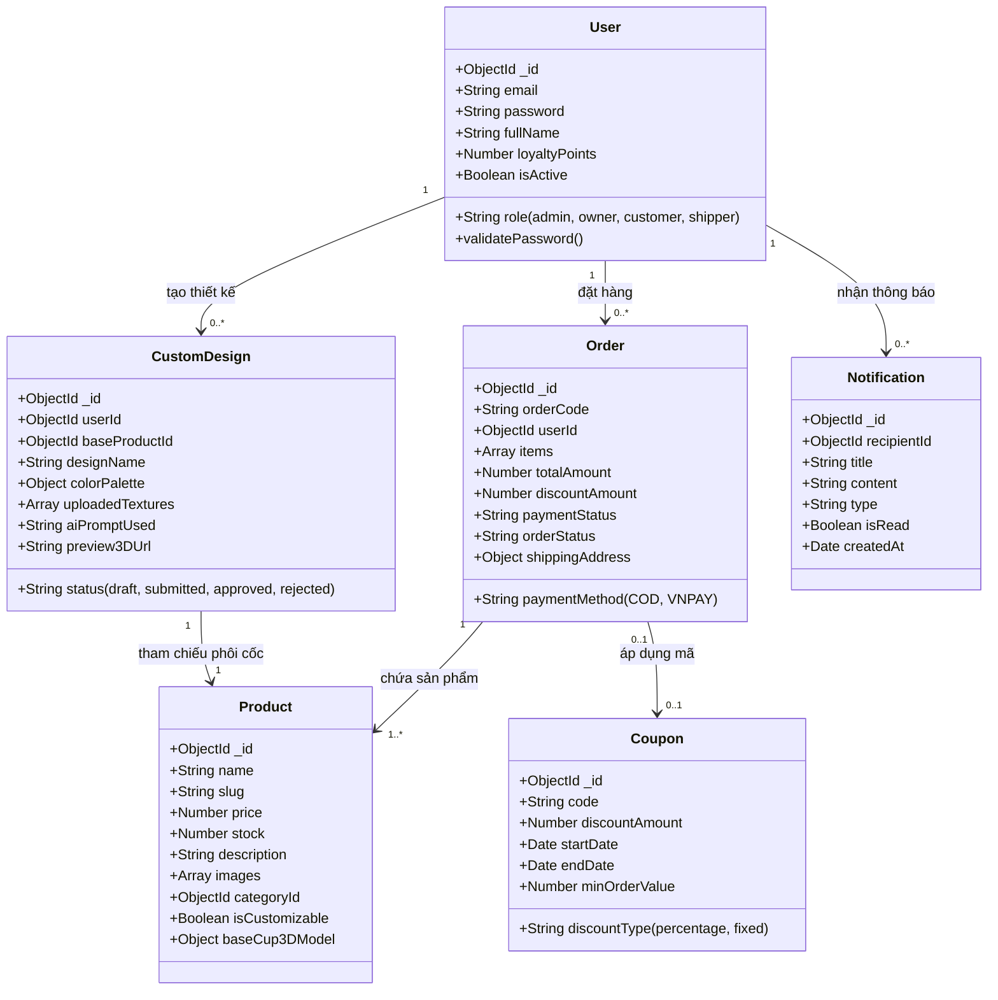

# BÁO CÁO ĐỒ ÁN MÔN THƯƠNG MẠI ĐIỆN TỬ
**ĐỀ TÀI: XÂY DƯNG WEBSITE THƯƠNG MẠI ĐIỆN TỬ KINH DOANH VÀ TÙY CHỈNH THIẾT KẾ LY CỐC 3D TRỰC TUYẾN (CUPSHOP)**

---

# CHƯƠNG 1. GIỚI THIỆU

## 1.1 Mô tả bài toán TMĐT
Trong những năm gần đây, ngành thương mại điện tử (TMĐT) bán lẻ đã có những bước phát triển vượt bậc. Người tiêu dùng không chỉ dừng lại ở việc tìm kiếm các sản phẩm có sẵn mà ngày càng có xu hướng tìm kiếm trải nghiệm **cá nhân hóa (Personalization)** cao cấp, đặc biệt là các sản phẩm mang dấu ấn cá nhân như ly, cốc, quà tặng lưu niệm.

Tuy nhiên, các mô hình bán ly cốc truyền thống hiện nay đang gặp phải nhiều hạn chế:
- **Khó hình dung sản phẩm thực tế:** Khách hàng khi đặt làm ly cốc in hình theo yêu cầu thường chỉ gửi file ảnh 2D qua Zalo, Facebook hoặc email, dẫn đến việc khó hình dung sản phẩm sau khi in lên bề mặt cong 3D sẽ như thế nào.
- **Quy trình trao đổi thủ công, tốn thời gian:** Nhận yêu cầu -> chỉnh sửa mockup 2D -> báo giá -> chốt mẫu -> đặt cọc -> sản xuất. Quy trình này phân mảnh qua nhiều kênh tin nhắn, dễ sai sót thông tin đơn hàng.
- **Thiếu sự hỗ trợ sáng tạo:** Khách hàng muốn có hình ảnh độc đáo nhưng không biết dùng phần mềm thiết kế chuyên nghiệp (Photoshop, AI).

Để giải quyết bài toán trên, hệ thống **Cupshop** ra đời với mô hình Thương mại Điện tử tích hợp công nghệ đồ họa **3D Realtime (Three.js)** và **Trí tuệ nhân tạo (AI)**. Hệ thống cho phép người dùng tự do tương tác xoay 360 độ, đổi màu sắc, thêm chữ, upload hình ảnh lên bề mặt cốc 3D ngay trên trình duyệt, đồng thời tích hợp AI gợi ý thiết kế độc đáo.

## 1.2 Xác định mục tiêu chung

### Mục tiêu kinh doanh
- Xây dựng nền tảng TMĐT chuyên biệt cho mặt hàng ly cốc và sản phẩm quà tặng tùy chỉnh, giúp tối ưu hóa quy trình từ khâu ý tưởng thiết kế đến khâu đặt hàng và thanh toán.
- Giảm 70% thời gian tư vấn và chốt mẫu thiết kế giữa khách hàng và nhân viên cửa hàng nhờ bộ công cụ Customizer 3D trực quan.
- Tăng tỷ lệ chuyển đổi đơn hàng (Conversion Rate) bằng trải nghiệm mua sắm tương tác sống động và cổng thanh toán nội địa tiện lợi (VNPAY).

### Mục tiêu kỹ thuật
- **Frontend:** Phát triển ứng dụng Web phản hồi nhanh (SPA/SSR) bằng **Next.js 16 (React 19)** và **Tailwind CSS**, tích hợp thư viện **Three.js / React Three Fiber** để render mô hình 3D mượt mà với hiệu năng cao.
- **Backend:** Xây dựng hệ thống kiến trúc RESTful API mạnh mẽ, bảo mật bằng **NestJS (TypeScript)** kết hợp cơ sở dữ liệu NoSQL **MongoDB (Mongoose)** đảm bảo tính mở rộng linh hoạt (Scalability).
- **Tích hợp dịch vụ đám mây (Cloud Infrastructure):** 
  - Tích hợp cổng thanh toán trực tuyến **VNPAY**.
  - Tích hợp hệ thống lưu trữ ảnh và texture 3D tốc độ cao **Cloudinary**.
  - Tích hợp WebSockets (**Socket.IO**) để gửi thông báo thời gian thực (Realtime Notifications) cho Admin và Khách hàng.
  - Tích hợp **Google AI (Gemini)** hỗ trợ tự động gợi ý mẫu thiết kế cho người dùng.

---

# CHƯƠNG 2. XÂY DƯNG KIẾN TRÚC

## 2.1 Kiến trúc hệ thống TMĐT
Hệ thống Cupshop được áp dụng kiến trúc **Client - Server hiện đại**, tách biệt hoàn toàn giữa giao diện người dùng (Frontend) và xử lý nghiệp vụ, dữ liệu (Backend). Sự giao tiếp giữa hai nền tảng được thực hiện thông qua giao thức **HTTPS RESTful API** chuẩn JSON và luồng kết nối song công **WebSockets** cho các tác vụ thời gian thực.

```mermaid
flowchart TB
    subgraph ClientLayer ["Lớp Khách hàng (Client Layer)"]
        Browser["Trình duyệt Web (PC/Mobile browser)"]
        ThreeCanvas["3D Customizer Engine (Three.js Canvas)"]
    end

    subgraph CDNLayer ["Lớp Phân phối & Proxy"]
        NextServer["Next.js SSR / Static CDN (Port 3005)"]
    </subgraph>

    subgraph ApplicationLayer ["Lớp Application Server (Backend NestJS - Port 3000)"]
        AuthService["Auth & JWT Security"]
        OrderService["Order & Checkout Service"]
        CustomService["Custom 3D Design Service"]
        NotifService["Realtime Socket.IO Gateway"]
    end

    subgraph DatabaseLayer ["Lớp Dữ liệu & Lưu trữ (Data Layer)"]
        MongoDB[(MongoDB Atlas Cluster)]
        Redis[(Cache / Queue Redis)]
    end

    subgraph ExternalServices ["Dịch vụ Bên thứ 3 (Third-party Cloud)"]
        VNPAY["Cổng thanh toán VNPAY"]
        Cloudinary["Cloudinary Image/Texture CDN"]
        GoogleAI["Google Gemini AI Engine"]
    </subgraph>

    Browser -->|HTTP GET/POST| NextServer
    Browser <-->|REST API / JWT| ApplicationLayer
    Browser <-->|WebSocket| NotifService
    NextServer -->|Render UI| Browser

    ApplicationLayer <-->|Mongoose ORM| MongoDB
    ApplicationLayer <-->|Caching| Redis

    OrderService <-->|Redirect / IPN| VNPAY
    CustomService <-->|Upload Texture| Cloudinary
    CustomService <-->|Prompt / Generate| GoogleAI
```

## 2.2 Cơ sở hạ tầng TMĐT
Cơ sở hạ tầng của hệ thống được xây dựng trên nền tảng điện toán đám mây (Cloud Computing) đảm bảo khả năng chịu tải cao và tính sẵn sàng liên tục (High Availability):
1. **Máy chủ ứng dụng (Application Hosting):** Backend NestJS được container hóa bằng Docker và triển khai trên hạ tầng VPS/Cloud (như AWS EC2, DigitalOcean hoặc Render), cấu hình Nginx làm Reverse Proxy và SSL Termination.
2. **Hệ quản trị cơ sở dữ liệu (Database Infrastructure):** Sử dụng **MongoDB Atlas Cloud Cluster** với kiến trúc Replica Set giúp phân tán dữ liệu, tự động sao lưu (Automated Backup) và đảm bảo tính nhất quán dữ liệu cho các giao dịch TMĐT.
3. **Mạng lưới phân phối nội dung (CDN & Media Storage):** Sử dụng **Cloudinary** làm nơi lưu trữ toàn bộ hình ảnh sản phẩm, avatar người dùng, các file thiết kế 3D texture và hình ảnh xuất ra từ AI. CDN giúp tối ưu dung lượng ảnh tự động (WebP/AVIF) và giảm trễ tải trang.
4. **Hạ tầng thanh toán điện tử:** Kết nối trực tiếp với cổng thanh toán quốc gia **VNPAY Sandbox/Production** thông qua cơ chế mã hóa chữ ký bảo mật SHA512 và xác thực giao dịch qua Webhook (IPN - Instant Payment Notification).

## 2.3 Kiến trúc và cơ sở hạ tầng phần mềm Cupshop
Mã nguồn Cupshop tuân thủ nghiêm ngặt nguyên lý thiết kế **SOLID** và mô hình **Modular Monolith** trong NestJS, chia tách hệ thống thành các module độc lập theo tính năng nghiệp vụ (Domain-Driven Design).

```mermaid
flowchart LR
    subgraph ControllerLayer ["Lớp Controller (API Routing)"]
        OrdersController["OrdersController"]
        ProductsController["ProductsController"]
        DesignsController["CustomDesignsController"]
    end

    subgraph ServiceLayer ["Lớp Service (Business Logic)"]
        OrdersService["OrdersService"]
        ProductsService["ProductsService"]
        DesignsService["CustomDesignsService"]
    end

    subgraph RepositoryLayer ["Lớp Data Access (Schemas)"]
        OrderModel["OrderSchema"]
        ProductModel["ProductSchema"]
        DesignModel["CustomDesignSchema"]
    end

    ControllerLayer -->|DTO / Validation| ServiceLayer
    ServiceLayer -->|Mongoose Queries| RepositoryLayer
```



---

# CHƯƠNG 3. MÔ HÌNH HÓA YÊU CẦU

## 3.1 Usecase Diagram (Hướng Package / Hướng Actor)

### 3.1.1 Sơ đồ mức tổng quát
Hệ thống phân định rõ ràng 4 nhóm tác nhân (Actor) chính tương tác với hệ thống: **Khách hàng (Customer)**, **Quản trị viên (Admin)**, **Chủ cửa hàng (Shop Owner)**, và **Nhân viên giao hàng (Shipper)**.



### 3.1.2 Sơ đồ chi tiết 1: Phân hệ Đặt hàng & Thanh toán VNPAY

```mermaid
flowchart TD
    Actor["Khách hàng (Customer)"]

    subgraph OrderSystem ["Phân hệ Đặt hàng & Thanh toán"]
        UC_Cart["Thêm sản phẩm vào giỏ hàng"]
        UC_ApplyCoupon["Áp dụng mã giảm giá (Coupon)"]
        UC_Checkout["Tiến hành đặt hàng (Checkout)"]
        UC_SelectPayment["Chọn phương thức thanh toán"]
        UC_PayCOD["Thanh toán khi nhận hàng (COD)"]
        UC_PayVNPAY["Thanh toán trực tuyến qua VNPAY"]
        UC_TrackOrder["Theo dõi trạng thái đơn hàng"]
    end

    Actor --> UC_Cart
    Actor --> UC_Checkout
    Actor --> UC_TrackOrder

    UC_Checkout .->|<<include>>| UC_SelectPayment
    UC_Checkout .->|<<extend>>| UC_ApplyCoupon
    UC_SelectPayment <|-- UC_PayCOD
    UC_SelectPayment <|-- UC_PayVNPAY
```

### 3.1.3 Sơ đồ chi tiết 2: Phân hệ Tùy chỉnh thiết kế 3D & AI



---

## 3.2 Bảng Usecase (Đặc tả chi tiết ca sử dụng)

### Bảng 3.1: Đặc tả Usecase "Đặt hàng và Thanh toán qua VNPAY"
| Thuộc tính | Mô tả chi tiết |
| :--- | :--- |
| **Tên Usecase** | Đặt hàng và Thanh toán qua cổng VNPAY |
| **Mã Usecase** | UC-ORD-001 |
| **Tác nhân chính** | Khách hàng (Customer đã đăng nhập) |
| **Mục tiêu** | Khách hàng hoàn tất việc tạo đơn hàng từ giỏ và thanh toán thành công qua VNPAY |
| **Điều kiện tiên quyết** | Giỏ hàng của khách có ít nhất 1 sản phẩm hợp lệ, tồn kho đủ cung ứng |
| **Luồng sự kiện chính (Basic Flow)** | 1. Khách hàng truy cập trang Giỏ hàng và nhấn nút "Thanh toán".<br/>2. Hệ thống hiển thị form nhập thông tin giao hàng và danh sách sản phẩm.<br/>3. Khách hàng nhập địa chỉ, chọn phương thức thanh toán là **"VNPAY"** và nhấn "Đặt hàng".<br/>4. Backend NestJS kiểm tra tồn kho, tạo đơn hàng với trạng thái `pending_payment` và khởi tạo URL thanh toán ký mã SHA512 từ VNPAY.<br/>5. Hệ thống chuyển hướng (Redirect) trình duyệt của khách sang trang thanh toán của VNPAY.<br/>6. Khách hàng thực hiện quét mã QR / nhập thông tin thẻ ATM nội địa để thanh toán.<br/>7. VNPAY xác thực thành công và gửi IPN (Webhook) báo về Backend Cupshop.<br/>8. Backend cập nhật trạng thái đơn thành `paid`, trừ số lượng tồn kho và gửi thông báo Realtime cho Admin.<br/>9. Trình duyệt hiển thị trang "Đặt hàng thành công". |
| **Luồng thay thế / Ngoại lệ** | - **4a. Tồn kho không đủ:** Hệ thống báo lỗi sản phẩm hết hàng, quay lại giỏ hàng.<br/>- **7a. Thanh toán VNPAY thất bại/Hủy:** Đơn hàng được giữ ở trạng thái `payment_failed` hoặc tự động hủy sau 15 phút, hoàn lại số lượng tạm giữ. |

---

## 3.3 Activity Diagram (3 luồng nghiệp vụ chính có khung phân làn theo hệ thống)

Để phản ánh chính xác sự tương tác giữa người dùng và các phân hệ phần mềm trong hệ thống Cupshop, các biểu đồ hoạt động (Activity Diagram) dưới đây được thiết kế theo mô hình phân làn (**Swimlanes / Khung bao quanh**), chỉ rõ trách nhiệm của từng tác nhân và các lớp hệ thống (Frontend, Backend NestJS, Dịch vụ Cloud).

### 3.3.1 Luồng 1: Đặt hàng & Thanh toán trực tuyến (Checkout & VNPAY Payment Workflow)



### 3.3.2 Luồng 2: Tùy chỉnh thiết kế ly cốc 3D & duyệt mẫu (Custom 3D Design Workflow)



### 3.3.3 Luồng 3: Xử lý đơn hàng & Giao hàng (Order Fulfillment & Shipping Workflow)



---

## 3.4 Sequence Diagram (Sơ đồ tuần tự chính)

### 3.4.1 Sơ đồ tuần tự: Luồng Đặt hàng và Thanh toán VNPAY



### 3.4.2 Sơ đồ tuần tự: Luồng Thông báo thời gian thực (Realtime Notification)



---

## 3.5 Statechart Diagram (Biểu đồ trạng thái đơn hàng)
Biểu đồ mô tả vòng đời của một Đơn hàng (`Order`) trong hệ thống Cupshop kể từ khi được khởi tạo cho đến khi kết thúc.



---

## 3.6 Class Diagram (Biểu đồ lớp thực tế từ mã nguồn Backend)
Sơ đồ mô tả các thực thể (Entities / Schemas) chính trong cơ sở dữ liệu MongoDB của hệ thống Cupshop và mối quan hệ giữa chúng.



---

## 3.7 Sơ đồ khai thác hệ thống (Deployment Diagram)
Sơ đồ mô tả cấu trúc triển khai vật lý và logic của hệ thống Cupshop trên môi trường máy chủ và điện toán đám mây.

```mermaid
flowchart TB
    subgraph ClientNodes ["Thiết bị người dùng (Client Nodes)"]
        PC["Máy tính cá nhân (PC / Laptop)"]
        Mobile["Điện thoại thông minh (Mobile App / Browser)"]
    end

    subgraph CloudInfrastructure ["Hạ tầng Đám mây Cupshop (Cloud Infrastructure)"]
        subgraph ProxyLayer ["Proxy & Firewall Layer"]
            Cloudflare["Cloudflare CDN / WAF Firewall"]
            Nginx["Nginx Reverse Proxy & SSL"]
        end

        subgraph WebTier ["Web Tier (Frontend Node)"]
            NextApp["Next.js SSR Container (Port 3005)"]
        </subgraph>

        subgraph AppTier ["Application Tier (Backend Node)"]
            NestApp["NestJS API Container (Port 3000)"]
            SocketServer["Socket.IO Realtime Engine"]
        </subgraph>

        subgraph DataTier ["Data & Cache Tier"]
            MongoCluster[(MongoDB Atlas Cluster Replicas)]
            RedisCache[(Redis Cache Memory)]
        </subgraph>
    end

    subgraph ExternalServices ["Dịch vụ Đám mây Ngoại vi (External API)"]
        VNPAYGateway["VNPAY Payment Gateway"]
        CloudinaryCDN["Cloudinary Media Storage"]
        GeminiAI["Google Gemini AI API"]
    </subgraph>

    PC -->|HTTPS| Cloudflare
    Mobile -->|HTTPS| Cloudflare
    Cloudflare -->|Route Traffic| Nginx
    Nginx -->|Frontend Requests| NextApp
    Nginx -->|API Requests| NestApp
    Nginx -->|WebSocket Upgrade| SocketServer

    NestApp <-->|Read / Write| MongoCluster
    NestApp <-->|Cache Session/Stock| RedisCache

    NestApp <-->|Secure Webhook / API| VNPAYGateway
    NestApp <-->|Upload 3D Assets| CloudinaryCDN
    NestApp <-->|Generate Design| GeminiAI
```

---
*Ghi chú: Toàn bộ các sơ đồ trên được thiết kế chuẩn sát với logic thực tế của mã nguồn Cupshop backend (`d:\do_an\ecommerce-backend`) và đáp ứng đầy đủ cấu trúc của file PDF yêu cầu đến hết mục 3.*
